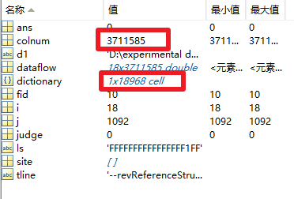

---


---

## 代码尝试和一些实验

```matlab
%填充字典，改变数据流
d1='D:\experimental data\铁轨探伤\兰州局数据\uncompress';
cd(d1)
fid=fopen('西平2019.9.9.txt','rt');
dataflow=[];
dictionary={};
colnum=0;
while ~feof(fid)
	tline=fgetl(fid);
	site=find(tline==',');
	if numel(site)~=18
		continue
	end
	site=[site,numel(tline)];
	colnum=colnum+1;
	for i=1:18
		if site(i+1)-site(i)>1
			ls=tline(site(i)+1:site(i+1)-1);
			ls=strtrim(ls);  %删除开头和结尾的空格
			judge=1;
			for j=1:numel(dictionary)
				if strcmp(ls,dictionary(j))
					judge=0;
					break
				end
			end
			if judge
				dictionary{numel(dictionary)+1}=ls;
				dataflow(i,colnum)=numel(dictionary);
			else
				dataflow(i,colnum)=j;
			end
		end
	end
end
fclose(fid);
```

运行情况：



```matlab
%统计各轨单字概率
d1='D:\experimental data\铁轨探伤\兰州局数据\uncompress';
cd(d1)
fid=fopen('西平2019.9.9.txt','rt');
load 西平2019.mat
load dictionary.mat
track={};
for i=1:18
	track{i}=zeros(2,size(dictionary,2));
	for j=1:size(dictionary,2)
		track{i}(1,j)=j;
		track{i}(2,j)=numel(find(dataflow(i,:)==j));
	end
	disp(i)
end
	
```


```matlab
%损坏与未损坏区分
d1='D:\experimental data\铁轨探伤\uncompress';
cd(d1)
dataflow_damage={};
%for k=1:148
k=1;
eval(['fid=fopen(''螺孔裂纹样本' num2str(k+1) '.txt'',''rt'');']);
colnum=0;
while ~feof(fid)
	tline=fgetl(fid);
	site=find(tline==',');
	if numel(site)~=19
		continue
	end
	site=[site,numel(tline)];
	colnum=colnum+1;
	for i=[2:9,11:18]
		if site(i+1)-site(i)>1
			temp=tline(site(i)+1:site(i+1)-1);
			temp=strtrim(temp);  %删除开头和结尾的空格
			for j=1:numel(temp)
				if temp(j)=='F'
					temp(j)='0';
				else
					temp(j)='1';
				end
			end
			dataflow_damage{k}(i-1,colnum)=bin2dec(temp);
		end
	end
end
```


## 文献阅读

-   [基于改进卷积神经网络的铁轨伤损图像识别_江白华.pdf](file\基于改进卷积神经网络的铁轨伤损图像识别_江白华.pdf) 


-  [高速铁路轨道无损探伤技术的研究现状和发展趋势_王雪梅.pdf](file\高速铁路轨道无损探伤技术的研究现状和发展趋势_王雪梅.pdf) 


-  [基于光声信号的高铁钢轨表面缺陷检测方法.pdf](file\基于光声信号的高铁钢轨表面缺陷检测方法.pdf) 


-  [钢轨探伤漏检螺孔裂纹的原因分析和应对措施.pdf](file\钢轨探伤漏检螺孔裂纹的原因分析和应对措施.pdf) 


-  A new approach for pre-stressing of rail-end-bolt holes

| Bolted joint railroad is the subject matter of this paper. Rail joint elements are subjected to cyclic and impact loads as a result of the passage of trains, which causes the origination and growth of fatigue cracks occurring, in most cases, around the bolt holes. Fatigue failure around rail-end-bolt holes is particularly dangerous because it leads to derailment of trains and, consequently, to inevitable accidents. Moreover, the cracking at rail-ends, which starts from bolt hole surface, causes premature rails replacement. The presence of residual compressive hoop stresses around the bolted holes, which is achieved by prestressing of these holes, extends the fatigue life of bolted joint railroads. This article presents an innovative technology for pre-stressing of rail-end-bolt holes, implemented on a vertical machining centre of Revolver vertical (RV) type. Two consecutive operations are involved in the manufacturing technology process: formation of the hole by drilling, reaming and making of a chamfer through a new combined cutting tool; cold hole working by spherical motion cold working through a new tool equipment, which minimizes the axial force on the reverse stroke. The new technology introduces beneficial residual compressive stresses around the bolted holes thereby preventing the fatigue cracks growth and increasing the fatigue life of these openings. |
| ------------------------------------------------------------ |
| 螺栓连接铁路是本文的主题。由于列车的通过，钢轨连接件承受循环载荷和冲击载荷，导致疲劳裂纹的产生和扩展，在大多数情况下，疲劳裂纹发生在螺栓孔周围。轨道端螺栓孔周围的疲劳破坏尤其危险，因为它会导致列车脱轨，从而导致不可避免的事故。此外，从螺栓孔表面开始的钢轨末端开裂，导致钢轨过早更换。螺栓孔周围残余压应力的存在，是通过对这些孔进行预应力实现的，从而延长了螺栓连接铁路的疲劳寿命。本文介绍了一种新颖的轨道端螺栓孔预应力技术，并在转轮立式加工中心上实现。在制造工艺过程中涉及到两个连续的工序:钻孔、扩孔和用新型组合刀具制造倒角;冷孔加工采用球面运动冷加工，通过一种新的工具设备，最大限度地减小了轴向力对反向冲程的影响。新技术在螺栓孔周围引入了有益的残余压应力，从而防止了疲劳裂纹的扩展，提高了这些孔的疲劳寿命。 |

-  浅析探伤车对螺孔裂纹的检测 


- 


## 疑问

- 这里的二进制实际对应关系是怎么样的
- ','有的文件是18个，有的文件是19个

