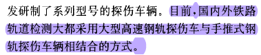

---


---

## 代码尝试和一些实验

```matlab
%填充字典，改变数据流
d1='D:\experimental data\铁轨探伤\兰州局数据\uncompress';
cd(d1)
fid=fopen('西平2019.9.9.txt','rt');
dataflow=[];
dictionary={};
colnum=0;
while ~feof(fid)
	tline=fgetl(fid);
	site=find(tline==',');
	if numel(site)~=18
		continue
	end
	site=[site,numel(tline)];
	colnum=colnum+1;
	for i=1:18
		if site(i+1)-site(i)>1
			ls=tline(site(i)+1:site(i+1)-1);
			ls=strtrim(ls);  %删除开头和结尾的空格
			judge=1;
			for j=1:numel(dictionary)
				if strcmp(ls,dictionary(j))
					judge=0;
					break
				end
			end
			if judge
				dictionary{numel(dictionary)+1}=ls;
				dataflow(i,colnum)=numel(dictionary);
			else
				dataflow(i,colnum)=j;
			end
		end
	end
end
fclose(fid);
```

运行情况：


```matlab
%统计各轨单字概率
d1='D:\experimental data\铁轨探伤\兰州局数据\uncompress';
cd(d1)
fid=fopen('西平2019.9.9.txt','rt');
load 西平2019.mat
load dictionary.mat
track={};
for i=1:18
	track{i}=zeros(2,size(dictionary,2));
	for j=1:size(dictionary,2)
		track{i}(1,j)=j;
		track{i}(2,j)=numel(find(dataflow(i,:)==j));
	end
	disp(i)
end
	
```


```matlab
%损坏与未损坏区分
d1='D:\experimental data\铁轨探伤\uncompress';
cd(d1)
dataflow_damage={};
%for k=1:148
k=1;
eval(['fid=fopen(''螺孔裂纹样本' num2str(k+1) '.txt'',''rt'');']);
colnum=0;
while ~feof(fid)
	tline=fgetl(fid);
	site=find(tline==',');
	if numel(site)~=19
		continue
	end
	site=[site,numel(tline)];
	colnum=colnum+1;
	for i=[2:9,11:18]
		if site(i+1)-site(i)>1
			temp=tline(site(i)+1:site(i+1)-1);
			temp=strtrim(temp);  %删除开头和结尾的空格
			for j=1:numel(temp)
				if temp(j)=='F'
					temp(j)='0';
				else
					temp(j)='1';
				end
			end
			dataflow_damage{k}(i-1,colnum)=bin2dec(temp);
		end
	end
end
```


## 文献阅读

-   [基于改进卷积神经网络的铁轨伤损图像识别_江白华.pdf](file\基于改进卷积神经网络的铁轨伤损图像识别_江白华.pdf) 


-  [高速铁路轨道无损探伤技术的研究现状和发展趋势_王雪梅.pdf](file\高速铁路轨道无损探伤技术的研究现状和发展趋势_王雪梅.pdf) 





-  [基于光声信号的高铁钢轨表面缺陷检测方法.pdf](file\基于光声信号的高铁钢轨表面缺陷检测方法.pdf) 


## 疑问

- 这里的二进制实际对应关系是怎么样的
- ','有的文件是18个，有的文件是19个

